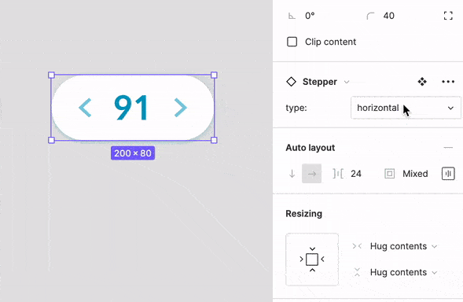
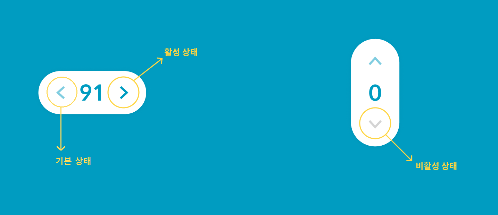

# stepper
## 데모
[📜 stepper demo](https://yeongjong310.github.io/reactWIL/index.html)

## 미션

Stepper 컴포넌트 Figma 디자인 파일을 분석해 React 컴포넌트를 설계한다.

## 기능 구현

- [X] 가급적 UI 디자인 시안과 최대한 비슷하게 구현해야 한다. (글꼴, 크기, 색상, 간격, 효과 등)
- [X] 컴포넌트 모드, 상태 처리 등을 고려해 설계한다. (mode, min, max, current, step 등)
- [X] 숫자 값 자리수에 따라 유연하게 좌우 버튼이 배치되도록 구현한다. (너비 또는 높이 고정 X)
- [X] 컴포넌트 테스트 수행은 권장사항(옵션)이다.

## 디자인 분석

- 방향을 설정할 수 있다.

- 상태에 따라 아이콘은 (normal[기본], active[활성], disabled[비활성]) 중 하나로 변경되어야 한다.

